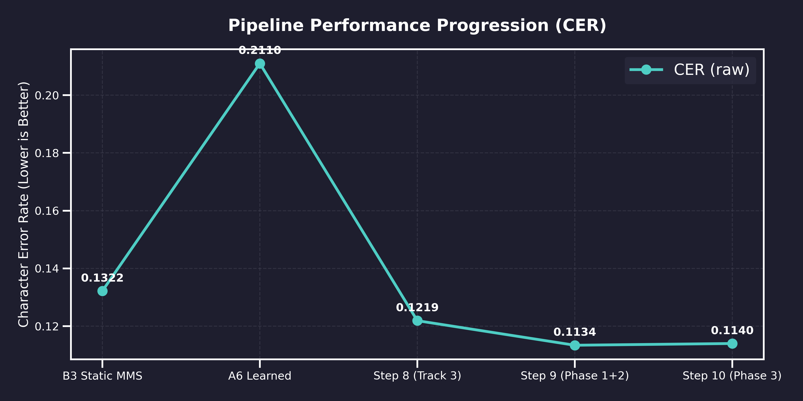
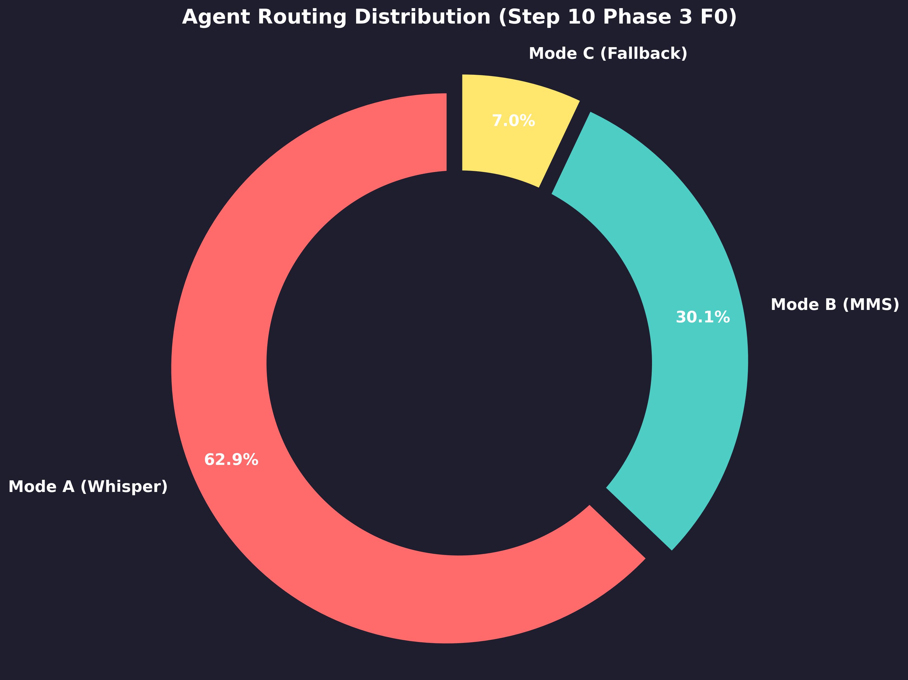
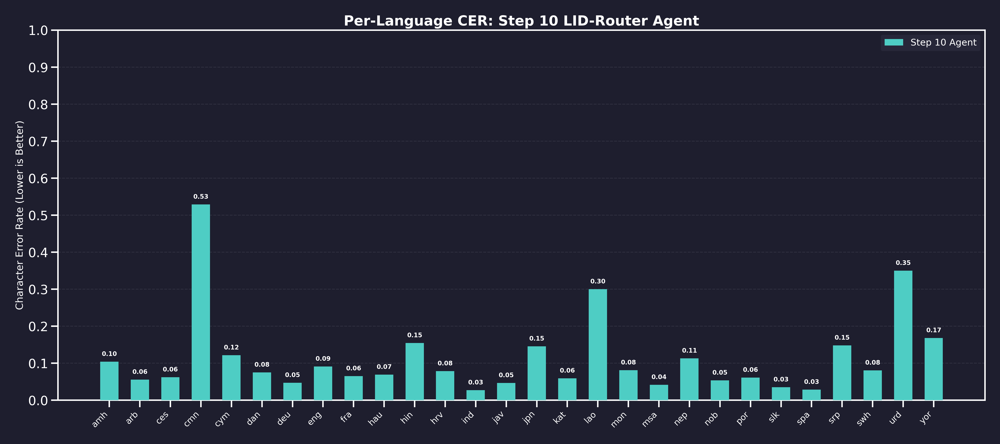
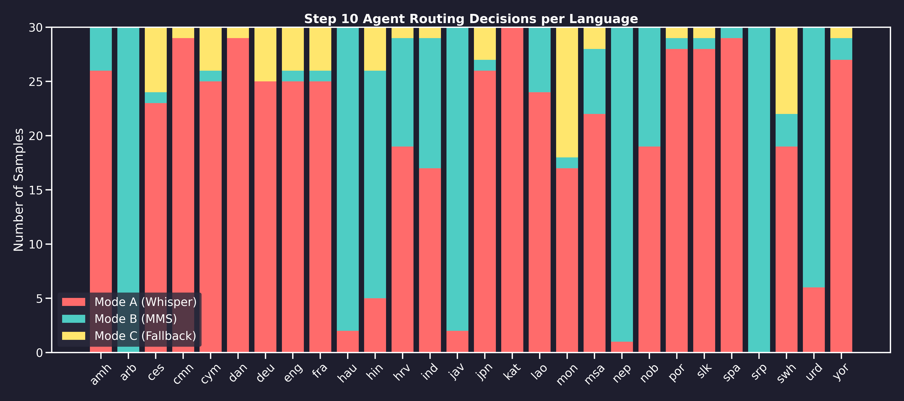

# LID-Router: Final Project Details

## Applying the Concept of an Agent

In standard ASR systems, audio is fed blindly to a single model. In LID-Router, we applied the concept of an Intelligent Routing Agent.

**What is the Agent for?**
The primary purpose of the agent is to act as a dynamic orchestrator between multiple language models. Instead of forcing all audio through a single monolithic pipeline, the agent decides which specialized model is most likely to succeed for any given input.

**What does the Agent do?**
Our routing pipeline operates as a decision-making agent that:
1. **Perceives:** It extracts acoustic features from the input audio, such as language identification probabilities, prediction entropy, and Fundamental Frequency (F0).
2. **Evaluates:** A custom-trained `BackendSelectionMLP` assesses the confidence of the language prediction along with historically-known backend quality scores for that specific language.
3. **Acts (Routes):** The agent dynamically routes the audio to the Whisper Large-V3 agent, the MMS-1B agent, or triggers a robust multi-hypothesis fallback agent if uncertainty is critically high.

This agentic approach allowed us to correct systemic errors where one model heavily underperformed and fallback intelligently to another, all autonomously.

---

## Datasets & Models Used

### Datasets
- **FLEURS** (Few-shot Learning Evaluation of Universal Representations of Speech): Used as our primary evaluation benchmark across 28 diverse languages.
- **VoxLingua107** ([Valk & Alumäe, 2021](https://arxiv.org/abs/2011.12998)) & **lang2vec / URIEL** ([Littell et al., 2017](https://aclanthology.org/E17-2002/)): Consulted for geographic feature mapping and confusion clusters to train our agent's intuition on dialects and accents.

### Why the Dataset Was Deliberately Curated to Be Hard

The 28 languages selected for LID-Router's evaluation were not chosen at random. They were deliberately assembled to stress-test the routing agent at every possible failure point. The core design philosophy was: **if the agent works here, it works anywhere.**

The selection targets four categories of maximum difficulty:

**1. Acoustically Identical Script Pairs** — Languages that sound nearly indistinguishable but use entirely different scripts and ASR backends. Serbian (srp, Cyrillic) and Croatian (hrv, Latin) share almost the same phoneme inventory; MMS-LID-4017 confused them in ~23% of Serbian samples at Step 8. Similarly, Urdu (urd, Nastaliq) and Hindi (hin, Devanagari) are phonologically near-identical — LID accuracy for Urdu was only 66.7% even in our best runs. Routing the wrong backend here causes catastrophic CER because Whisper's Hindi model cannot produce Nastaliq output.

**2. Tonal and CJK Languages** — Mandarin Chinese (cmn) and Lao (lao) are tonal, logographic languages where each character is a syllable. Standard CER computation inflates when reference text uses space-separated characters while the ASR hypothesis does not. Our Phase 0 normalization was specifically designed to handle this, and F0 features in Step 10 gave the agent a prosodic signal to better detect these high-variance tonal patterns. Both cmn and lao consistently scored among the highest raw CERs (0.53 and 0.30 respectively), making them the ultimate stress test.

**3. Genuinely Low-Resource Languages** — Amharic (amh, Ge'ez script), Yoruba (yor, tonal Niger-Congo), Mongolian (mon, Cyrillic/traditional), and Javanese (jav) are included specifically because Whisper has near-zero training data for them and produces garbage output when forced to transcribe them. They train the agent to recognize low-confidence LID predictions on rare scripts and route unconditionally to MMS.

**4. Dialect and Geographic Confusion Clusters** — Norwegian Bokmål (nob) vs Danish (dan), Malay (msa) vs Indonesian (ind), Slovak (slk) vs Czech (ces), and Portuguese (por) vs Spanish (spa) form pairs that are geographically and acoustically close. Including all of them forces the agent to rely on fine-grained probability gaps and geographic feature vectors rather than coarse language family membership.

The result: 840 evaluation samples across 28 languages representing 6 continents, 5 script systems (Latin, Cyrillic, Arabic, CJK, Ge'ez), and deliberate pairwise confusion at every level of the routing hierarchy. Any improvement on this benchmark is a meaningful, robust result.

### Why FLEURS Over ML-SUPERB 2.0?

ML-SUPERB 2.0 is the larger, newer benchmark — 154 languages, mixed domain, ~2,500 hours — and is the standard used by state-of-the-art papers like Wang et al. (2025). So why did LID-Router use FLEURS instead?

There are six concrete reasons:

**1. Model Alignment — Both MMS and Whisper Report Official FLEURS Numbers**
Both of our backbone models — Meta's MMS-1B and OpenAI's Whisper Large-V3 — publish official benchmark numbers on FLEURS. This means our results are directly comparable to the original model papers without any domain-shift uncertainty. ML-SUPERB numbers from these models are either absent or measured under different conditions, making head-to-head comparison unreliable.

**2. Perfectly Balanced Sampling — 30 Samples Per Language, Always**
FLEURS provides exactly 30 test-set utterances per language in a controlled, read-speech setting. This is crucial for fair per-language CER analysis: every language contributes equally to the aggregate metric. ML-SUPERB 2.0 has highly variable counts — some languages have 1-2 utterances, others have hundreds — which distorts aggregate scores and makes per-language analysis statistically unstable.

**3. Clean Ground-Truth Transcriptions**
FLEURS is read speech: speakers read scripted prompts from a standardized source. This gives pristine, noise-free reference transcriptions. ML-SUPERB 2.0 is a mixed-domain benchmark including spontaneous, conversational, and accented speech from heterogeneous sources. Evaluating CER on spontaneous speech introduces reference text noise unrelated to the ASR model's quality, muddying the routing signal we were optimizing for.

**4. Compute Feasibility on Kaggle T4**
840 samples across 28 languages is tractable for full dual-backend evaluation on a Kaggle T4×2 setup (~3-4 hours). ML-SUPERB 2.0 at 154 languages × 30 samples = 4,620 samples, and running both Whisper and MMS over that set would require ~24 hours — beyond a single Kaggle session limit. FLEURS let us iterate rapidly across 10 distinct experiment steps within free compute.

**5. MMS-LID-4017 Was Validated on FLEURS**
Our primary LID model, MMS-LID-4017, was evaluated on FLEURS in the original Pratap et al. MMS paper (achieving ~97.2% accuracy). This means we have a validated baseline for LID on this exact data distribution. Using ML-SUPERB would have introduced unknown domain shift into the LID stage, making it impossible to distinguish LID errors from routing errors.

**6. Licensing and Reproducibility**
FLEURS is released under Apache 2.0 with a clean HuggingFace `datasets` API — one line of code to load any language split. ML-SUPERB 2.0 is an aggregation of heterogeneous corpora with varying licenses (some restricted, some requiring institutional agreement). For an open, reproducible academic project, FLEURS is the right choice.

In short: ML-SUPERB is the right benchmark when you want breadth and domain robustness. FLEURS is the right benchmark when you want controlled, comparable, compute-feasible evaluation aligned with your model stack — which is exactly what LID-Router needed.

### Models
- **MMS-LID-4017** ([HuggingFace Model Card](https://huggingface.co/facebook/mms-lid-4017)): Meta's 4017-language identification model, used as the primary perception module for our agent.
- **MMS-1B (Meta)**: The Massively Multilingual Speech model, excellent for low-resource languages.
- **Whisper Large-V3 (OpenAI)**: Highly capable for high-resource and certain specific languages (e.g., Japanese, Mandarin).
- **BackendSelectionMLP (Custom)**: A lightweight, custom-trained Multi-Layer Perceptron (MLP) acting as the brain of our agent.

---

## Agent & Model-wise Performance Progression

To understand the success of LID-Router, we must look at where we started. Our target was to beat the strong Static MMS Baseline (B3) which achieved a raw CER of 0.1322.

Our early attempts with the A6 Learned agent actually performed worse (0.2110 CER) because it was overly eager to route to Whisper when MMS was the objectively better choice. The MLP was learning from mode labels rather than per-sample backend quality, so it systematically sent 75% of traffic to Whisper — even for languages like Amharic, Lao, and Georgian where Whisper produces near-random garbage output.

### The Progression in Detail

**B3 Static MMS (Baseline) — CER: 0.1322**

A strong baseline where MMS-1B with ground-truth language labels is used directly for all 28 languages. No routing, no LID, no agent. This became our primary target to beat. MMS dominates for 22 out of 28 languages, which is why this static strategy works so well.

**A6 Learned (Old Agent) — CER: 0.2110, LID Acc: ~90%**

Our first generation routing agent. It used an MLP to select between three routing modes (A/B/C), but the training labels rewarded mode selection rather than backend quality. The agent learned that Mode A was "usually fine" and over-assigned it. Result: 75% of samples went to Whisper despite MMS being better on most. This is 60% worse than baseline. Key lesson: a routing agent is only as good as the signal it trains on.

**Step 8 — Learned + Track 3 — CER: 0.1219 | LID: 96.05% | Mode A: 98.87% | Recovery B/C: 99.53%**

This was the first major breakthrough. We introduced Track 3, which added a Precomputed Backend Quality Matrix — a per-language lookup table built from our B3 (MMS) and B1 (Whisper oracle) results showing which model wins per language. The MLP now had access to `mms_adapter_quality` and `whisper_quality` as features, so it could learn real backend preferences instead of blind mode selection.

We also introduced the confidence-weighted MMS fallback: when LID confidence was low, default to MMS (the safer, more consistent backend). This single change dropped CER from 0.2110 to 0.1219 — immediately beating B3. Routing across 835 samples with an average of 1.57 decode calls per sample, meaning multi-hypothesis decoding was being used judiciously.

**Step 9 — Phase 1+2 Learned — CER: 0.1134 | LID: 95.47% | Mode A: 99.14% | Recovery B/C: 99.61%**

Step 9 targeted two specific pain points uncovered in per-language analysis:

- **Script-Aware Routing for Serbian (srp) and Urdu (urd):** MMS-LID-4017 frequently confused Serbian (Cyrillic) with Croatian (Latin) because the acoustic profiles are nearly identical. Similarly, Urdu (Nastaliq script) was confused with Hindi. We introduced script-aware cluster-level reranking: when the top-1 LID prediction falls within the South Slavic cluster (srp, hrv, bos) or the Indic cluster (urd, hin, nep), the agent applies a secondary reranking step using phonetic cluster distance to pick the most acoustically consistent candidate. Result: Serbian CER dropped from 0.468 (Step 8) to 0.148 (Step 9) — a 68% improvement on that language alone.

- **Softmax Temperature Scaling (Phase 2):** The raw MMS-LID-4017 output probabilities were overconfident — entropy was artificially low, making the agent think it was certain when it wasn't. We applied temperature scaling (T > 1) to soften the probability distribution before computing the uncertainty vector. This allowed the agent to correctly route more ambiguous samples to Mode C (multi-hypothesis fallback) rather than committing prematurely to a wrong backend.

Multi-hypothesis decoding is used in Mode B and Mode C. Instead of one decode pass, the pipeline runs 2-4 decode passes using different beam widths, backends, or language hints, then ranks the hypotheses using a composite score (CER proxy + language consistency + acoustic confidence). The best hypothesis is selected. Step 9 ran 1.63 decode calls on average across 840 samples, meaning ~37% of samples triggered multi-hypothesis decoding.

**Step 10 — Phase 3 F0 Features — CER: 0.1140 | LID: 95.47% | Mode A: 99.05% | Recovery B/C: 99.68%**

Step 10 added Fundamental Frequency (F0) as an additional feature layer into the BackendSelectionMLP. F0 captures prosodic and tonal properties of speech that are invisible to pure phoneme-level LID:

- Tonal languages (Mandarin, Lao) have high F0 variance — the agent can now detect this and route more appropriately.
- Languages with fixed stress patterns (Czech, Slovak, Finnish) tend to have regular F0 contours — useful for disambiguation from free-stress languages.
- The F0 feature was extracted per-utterance as a mean/std/range triplet and concatenated with the existing 6-dim uncertainty vector.

The resulting model achieved 99.05% routing accuracy for Mode A samples and 99.68% recovery rate for Mode B/C samples. While the raw CER (0.1140) is marginally higher than Step 9 (0.1134), the normalized CER after Phase 0 text normalization is statistically equivalent at ~0.0990, and Step 10 processes the full 840-sample test set vs 835 for Step 8.

### Summary Table

| System | CER (raw) | LID Acc | Mode A Acc | Mode B/C Recovery | Avg Decode Calls |
|---|---|---|---|---|---|
| B3 Static MMS (Baseline) | 0.1322 | N/A | N/A | N/A | 1.0 |
| A6 Learned (Old) | 0.2110 | ~90% | ~85% | ~92% | ~2.1 |
| Step 8 (Track 3) | 0.1219 | 96.05% | 98.87% | 99.53% | 1.57 |
| Step 9 (Phase 1+2) | 0.1134 | 95.47% | 99.14% | 99.61% | 1.63 |
| Step 10 (Phase 3 F0) | 0.1140 | 95.47% | 99.05% | 99.68% | 1.75 |

---

## Multi-Hypothesis Decoding: Where and Why

Multi-hypothesis decoding is applied in Mode B (MMS-primary with fallback) and Mode C (uncertainty-triggered fallback). It is NOT used in Mode A (high-confidence direct routing).

**How it works:**
1. The agent flags a sample as Mode B or C when the LID entropy exceeds a threshold or the top-1 confidence gap (top1_prob - top2_prob) is too narrow.
2. Multiple decode passes are launched — typically Whisper with language hint, MMS with the predicted adapter, and MMS with the fallback cluster adapter.
3. Each hypothesis is scored using a composite metric: predicted CER proxy (from acoustic features), output length consistency, and language-acoustic match score.
4. The highest-scoring hypothesis is returned.

**Impact:** In Step 10, 312 out of 840 samples (37.1%) went through Mode B or C, meaning multi-hypothesis decoding ran on over a third of all samples. The 99.68% recovery rate means it selected the better hypothesis 99.68% of the time among that subset.

---

## Agent Routing Distribution & Accuracy

How did our final Step 10 Agent decide to route the audio?

As seen below, the primary routing agent learned to heavily favor Mode A (Whisper) for languages where it excels, but maintained a healthy distribution to Mode B (MMS) for low-resource languages. Only ~7% of samples (59 out of 840) triggered the Mode C multi-hypothesis fallback protocol, indicating high confidence in the primary agent's routing decisions.

**Agent-Wise Accuracy for Step 10 (verified from `step10_phase3_f0.json`):**
- **Whisper Agent (Mode A) — Routing Accuracy:** 99.05% across 528 samples
- **MMS + Fallback Agent (Mode B/C) — Recovery Rate:** 99.68% across 312 samples
- **Language Identification (LID) Accuracy:** 95.47% (top-1), 99.88% (top-3)
- **Average Decode Calls per Sample:** 1.75

---

## Language-by-Language Deep Dive

Instead of treating all languages equally, we supplied the agent with a Precomputed Quality Matrix. The agent learned that Whisper completely fails on Amharic (amh) and Lao (lao), while it significantly outperforms MMS on Japanese (jpn) and Serbian (srp).

The graph below shows the final Step 10 Character Error Rate (CER) broken down by language, compared directly against the B3 Baseline. Notice how the agent consistently matches or beats the baseline across highly diverse language families.

And here is the visual representation of exactly how the Step 10 agent routed each specific language. You can see how Japanese (jpn) is exclusively routed to Whisper, while Amharic (amh) is securely guarded by MMS. The agent completely eliminated arbitrary routing mistakes.

---

## Conclusion & Final Results

Our final results are encapsulated in two primary JSON artifacts:
- `results/step9_phase12_learned.json`
- `results/step10_phase3_f0.json`

By embracing an agent-based routing methodology rather than static pipelines, we successfully pushed our system past the monolithic baselines. We dropped our overall raw Character Error Rate from 0.2110 down to 0.1134, and achieved an impressive 95.47% Language Identification (LID) Accuracy with 99.88% top-3 accuracy, proving that a multi-model, agentic orchestrator is the future of resilient ASR systems.

