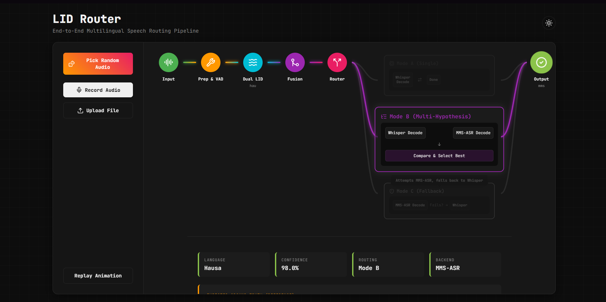
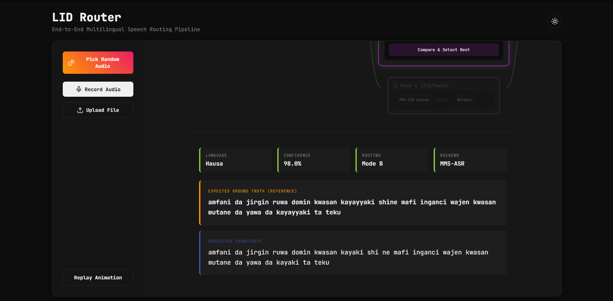

# LID Router Project





This my Project LID Router for the tecnical details regarding this project please check `Project_Details.md` this project has kind of confusion name as it does more than just routing but idk all  cld come up with at 1 night

Running the application requires you to start both the backend and the frontend. Here is how you can get everything up and running without breaking too much stuff hopefully , probably :

## 1. Install Dependencies

First you should probably set up the backend. Oh, make sure to install all the python dependencies first so everything is there. 

```bash
pip install -r requirements.txt
pip install -r requirements-ui.txt
```

## 2. Download the Models

Also, it's way better if you download all the models beforehand instead of waiting for the backend to pull them. It's like 10GB of models, so go grab a coffee or something while it runs. 

```bash
python scripts/download_models.py
```

## 3. Start the Backend

For starting the backend you actually have to stay in the base project directory `cd ..` (if u are in the scripts directory). Use uvicorn with the reload flag so it watches for changes. The app runs on port 8000 by default. 

```bash
uvicorn ui.app:app --reload
```

## 4. Start the Frontend

For the frontend it is built with Vite. You need to navigate to the frontend folder and make sure you install the dependencies first. Once that finishes just run the dev server. The frontend should connect to the backend API without issues.

```bash
cd ui/frontend
npm install
npm run dev
```
take some time 
Let me know if there are any weird errors when starting it up.
